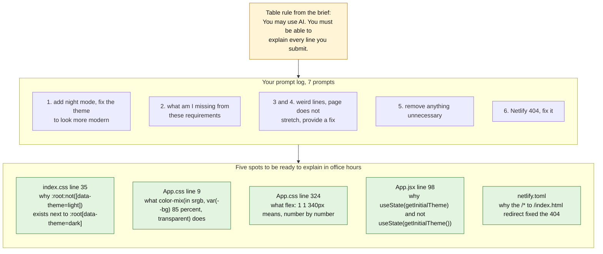
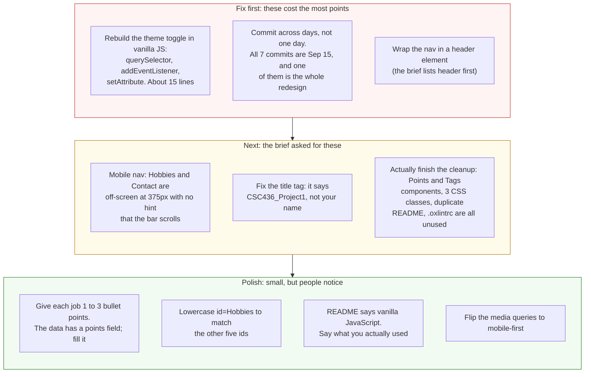

# Project 1: Static Foundations — Feedback

**Student:** Tavish Chen · **Repo:** [chentavish/CSC436_Project1](https://github.com/chentavish/CSC436_Project1) · **Live:** [chentproject1.netlify.app](https://chentproject1.netlify.app/)
**Reviewed at commit:** `25a809e` · **Course:** CSC 436, Fall 2026

> **How this review was made.** Your instructor reviewed this project with [Claude](https://claude.com) (Anthropic's AI) as a second set of eyes. Claude cloned the repo, read every line of the React source and both stylesheets, loaded the live site at phone, tablet and desktop widths, validated the rendered DOM, clicked the theme toggle and checked that it persisted, and read the prompt log you submitted. Every note and every point below was read and approved by your instructor. Same standard, same rubric, just more time spent looking at *your* code than one human has in a grading week.

## Grade: 80 / 100

| Category | Points | Earned | One line |
|---|:-:|:-:|---|
| Semantic HTML | 20 | 17 | Clean outline, valid DOM, excellent alt text; no `header`, and the title tag is the Vite default |
| CSS layout | 25 | 23 | Flexbox everywhere it should be, Grid on education, a real design system with dark mode |
| Responsive design | 15 | 12 | No horizontal scroll; but the phone nav hides two links with no hint that it scrolls |
| JavaScript interaction | 15 | 10 | The toggle is excellent; it's React, and the brief said vanilla JavaScript |
| Repository and deployment | 15 | 10 | README complete, deploy configured correctly; all 7 commits on the due date, one is the whole redesign |
| Content and polish | 10 | 8 | Real résumé content, real rank screenshot; thin experience entries, leftover unused code |
| **Total** | **100** | **80** | **A polished site built on the wrong foundation for this assignment.** |

## The short version

This is the most finished-looking site in the class. Sticky blurred nav, a dark mode that respects the system setting and remembers your choice, focus rings on everything, a design token system, a timeline with pseudo-element dots. It looks like a real portfolio because the content is real: four jobs, two degrees, a résumé PDF, and a Challenger rank with the screenshot to prove it.

Two things pull it down. First, the brief's opening sentence says "semantic HTML, modern CSS layout, and vanilla JavaScript," and this is a React 19 app compiled by Vite. The theme toggle is well built, but the three skills the JavaScript category exists to test, selecting elements, listening for events, changing the DOM, are done by React on your behalf. Second, your prompt log. The brief allows AI, and the log shows the AI redesigned the site, checked the requirements for you, fixed the layout, did the cleanup pass, and fixed the deploy. That's allowed. The rule that comes with it is that you can explain every line. The review below names five specific spots. Be ready to walk through them in office hours.

## What the numbers looked like

Things Claude measured (so you know these aren't guesses):

| Check | Result |
|---|---|
| Horizontal scroll at 375 / 768 / 1280 px | None at any width |
| Console errors | 0 |
| W3C validator on the rendered DOM | 0 errors from your code (one from Netlify's injected badge) |
| Heading order | h1 → h2 → h3, no skipped levels |
| Semantic elements | `nav`, `main`, 6 `section`s, `footer`. No `header`, no `article` |
| Nav links reachable at 375px without swiping | 3 of 5 (Hobbies and Contact are off-screen) |
| Theme toggle | Works; sets `data-theme`, writes `localStorage`, flips `aria-pressed` and the label |
| Education grid columns at 375 / 768 / 1280 | 1 / 2 / 2 |
| Framework | React 19.2 + Vite 8, built on Netlify |
| Unused code | `Points` and `Tags` components, `.entry-points`, `.tags`, `.entry-details` CSS, `.oxlintrc.json`, duplicate README |
| `<title>` | "CSC436_Project1" |
| Commits | 7, all on Sep 15 between 1:08 PM and 10:23 PM |

---

## Semantic HTML — 17 / 20

**What's working**

- One `h1`, then `h2` per section, `h3` per entry. The rendered DOM validates. `nav` has `aria-label="Main"`, the timeline is an `ol` because order matters, the toggle button has `aria-pressed` and a label that changes with state. The rank screenshot's alt text ([App.jsx L199](https://github.com/chentavish/CSC436_Project1/blob/25a809e/Project1/src/App.jsx#L199)) actually describes the image.
- Every external link has `rel="noreferrer"`. The résumé is a real PDF at a real path.

**What to change**

- **No `header`.** The nav sits in a bare `<div>` ([App.jsx L108–129](https://github.com/chentavish/CSC436_Project1/blob/25a809e/Project1/src/App.jsx#L108-L129)). The brief lists `header` first among the elements it wants to see. Wrap the nav in one. Thirty seconds.
- **The page title is `CSC436_Project1`** ([index.html L7](https://github.com/chentavish/CSC436_Project1/blob/25a809e/Project1/index.html#L7)). That's the Vite scaffold's default, and it's what shows in the browser tab and in search results. It should be your name.
- **Education entries are `div`s** ([L182](https://github.com/chentavish/CSC436_Project1/blob/25a809e/Project1/src/App.jsx#L182)). Each is a self-contained item with a heading; that's an `article`. Same for the timeline items, which are `li`s and could be `li > article`.
- Small: `id="Hobbies"` ([L193](https://github.com/chentavish/CSC436_Project1/blob/25a809e/Project1/src/App.jsx#L193)) is the only capitalized id on the page. Fragment ids are case-sensitive, so it works, but it's inconsistent with the other five.

## CSS layout — 23 / 25

**What's working**

- **Flexbox is doing real work in at least eight places:** the sticky nav with `space-between`, the hero column, both button rows, every timeline entry header (title left, dates right), the rank showcase, the contact block. `flex: 1 1 340px` on the screenshot ([App.css L324](https://github.com/chentavish/CSC436_Project1/blob/25a809e/Project1/src/App.css#L324)) so it wraps under the card on narrow screens. Correct everywhere.
- **Grid on the education section** with `auto-fit, minmax(260px, 1fr)` ([L300–304](https://github.com/chentavish/CSC436_Project1/blob/25a809e/Project1/src/App.css#L300-L304)). Right pattern.
- **This is a real design system.** Tokens in `:root`, dark values under both `prefers-color-scheme` and `[data-theme]` so the toggle can override the OS ([index.css L34–64](https://github.com/chentavish/CSC436_Project1/blob/25a809e/Project1/src/index.css#L34-L64)), `color-mix` for the translucent nav, `backdrop-filter`, `:focus-visible` on every interactive element, `prefers-reduced-motion` guarding smooth scroll, nested `@media` rules. Most of the class hasn't seen half of these.

**What to change**

- **The Grid has two items.** It's a correct Grid, but with two education entries it never does more than two columns. Fine for the rubric; just know it's the thinnest use of Grid on the page. The timeline or a projects section would give it more to do.
- **Three CSS rules match nothing:** `.entry-points`, `.tags`, `.entry-details` ([L237–262](https://github.com/chentavish/CSC436_Project1/blob/25a809e/Project1/src/App.css#L237-L262), [L310–313](https://github.com/chentavish/CSC436_Project1/blob/25a809e/Project1/src/App.css#L310-L313)). They style data fields (`points`, `tags`, `details`) that none of your jobs or schools actually have. Prompt 5 in your log asked the AI to remove unused code. It didn't, and nobody checked.

## Responsive design — 12 / 15

**What's working**

- No horizontal scroll at 375, 768 or 1280. Font size, heading size and section padding all step down under 1024px. The rank showcase stacks. The education grid collapses to one column. Buttons wrap.

**What to change**

- **The phone nav hides two of five links.** Under 760px the nav list gets `overflow-x: auto` with the scrollbar hidden ([App.css L102–106](https://github.com/chentavish/CSC436_Project1/blob/25a809e/Project1/src/App.css#L102-L106)). At 375px you see "About, Experience" and nothing tells you Hobbies and Contact exist to the right. Claude measured: they sit at 396px and 478px, past the 375px edge. A hamburger, a wrap onto a second row, or even a fade on the right edge would fix it. Right now a phone user can't find your Hobbies section from the nav.
- **Desktop-first.** Every breakpoint is `max-width`. The brief asked for mobile-first. Flip to `min-width` and the base styles become the phone.

## JavaScript interaction — 10 / 15

**What's working**

- The theme toggle is a genuinely good implementation: it reads localStorage first, falls back to the OS preference, writes the attribute and the storage in one effect, swaps the icon, and keeps `aria-pressed` and `aria-label` in sync ([App.jsx L52–56](https://github.com/chentavish/CSC436_Project1/blob/25a809e/Project1/src/App.jsx#L52-L56), [L98–105](https://github.com/chentavish/CSC436_Project1/blob/25a809e/Project1/src/App.jsx#L98-L105), [L119–127](https://github.com/chentavish/CSC436_Project1/blob/25a809e/Project1/src/App.jsx#L119-L127)). Claude clicked it, waited, and confirmed all of that happens. Zero console errors.

**What to change**

- **It's React, and the brief said vanilla JavaScript.** The first sentence of the brief, and the JavaScript requirement itself: "It must select elements, listen for an event, and change the page." Your code doesn't select an element or touch the DOM; React does that for you from state. The skill the category tests was outsourced to the framework. The same toggle in vanilla JS is about fifteen lines:

  ```js
  const button = document.querySelector('.theme-toggle');
  const root = document.documentElement;
  const saved = localStorage.getItem('theme');
  const prefersDark = matchMedia('(prefers-color-scheme: dark)').matches;
  root.dataset.theme = saved ?? (prefersDark ? 'dark' : 'light');

  button.addEventListener('click', () => {
    const next = root.dataset.theme === 'dark' ? 'light' : 'dark';
    root.dataset.theme = next;
    localStorage.setItem('theme', next);
    button.setAttribute('aria-pressed', next === 'dark');
  });
  ```

  ```mermaid
  flowchart TB
      subgraph brief["What the brief asked for: vanilla JavaScript"]
          direction LR
          v1["document.querySelector<br/><b>select</b> an element"] --> v2["addEventListener<br/><b>listen</b> for an event"] --> v3["setAttribute / classList<br/><b>change</b> the page"]
      end
      subgraph yours["What shipped: React 19 + Vite build"]
          direction LR
          r1["useState('light')<br/>state lives in React"] --> r2["onClick={toggleTheme}<br/>React synthetic event"] --> r3["useEffect writes<br/>data-theme + localStorage<br/>React re-renders the DOM"]
      end
      note["The toggle works and is well built.<br/>But the three skills the brief names<br/>(select, listen, change) are done by React,<br/>not by you. That is the deduction."]
      brief ~~~ yours
      yours --> note
      style v1 fill:#e3f4e1,stroke:#2e7d32,color:#111
      style v2 fill:#e3f4e1,stroke:#2e7d32,color:#111
      style v3 fill:#e3f4e1,stroke:#2e7d32,color:#111
      style r1 fill:#fff4d6,stroke:#b7791f,color:#111
      style r2 fill:#fff4d6,stroke:#b7791f,color:#111
      style r3 fill:#fff4d6,stroke:#b7791f,color:#111
      style note fill:#fde2e2,stroke:#c0392b,color:#111
  ```

- **Two components are never rendered with data.** `Points` and `Tags` ([L75–95](https://github.com/chentavish/CSC436_Project1/blob/25a809e/Project1/src/App.jsx#L75-L95)) are called for every job, and every job has no `points` and no `tags`, so they return `null` four times each. Either fill the data or delete the components.

## Repository and deployment — 10 / 15

**What's working**

- README has all four required items, and the run instructions are correct for a Vite project. `.gitignore` is right (`node_modules`, `dist`, `.DS_Store`). `netlify.toml` sets the base directory, build command, publish folder and the SPA redirect, which is exactly what a Vite app on Netlify needs. The live site matches the repo.

**What to change**

- **All seven commits are on September 15**, from 1:08 PM to 10:23 PM. Two of them are README edits, one is a one-line fix, and one, "Project fully changed to a personal portfolio," is 533 lines and is the entire site. The scaffold went in at 1:55 PM and the real work landed in a single commit at 10:14 PM. The brief asked for history that shows the project developing over time. This history shows a template, then a finished site.
- **The README describes a different project.** It says the site uses "semantic HTML, modern CSS layout, and vanilla JavaScript." That's the brief's sentence. Your site uses React and a build step. Say what you built. And there are two READMEs ([root](https://github.com/chentavish/CSC436_Project1/blob/25a809e/README.md) and [Project1/README.md](https://github.com/chentavish/CSC436_Project1/blob/25a809e/Project1/README.md)) with the same text.
- Leftovers from the scaffold: `.oxlintrc.json` and the `lint` script, which nothing in the brief needs.

## Content and polish — 8 / 10

**What's working**

- The content is real and specific. Four jobs with dates and locations, two degrees, a résumé that opens, an email and LinkedIn that go somewhere, and a hobby section with a real screenshot and a real number. The dark mode is smooth, the focus rings are on-brand, the timeline dots are a nice touch.

**What to change**

- **The experience entries are just titles.** Company, role, dates, location, and nothing about what you did. The data structure has a `points` field for exactly this. One to three bullets per job turns a list into a résumé.
- The tab title says `CSC436_Project1`. First thing a recruiter sees.
- The cleanup prompt didn't clean up. Unused components, unused CSS, duplicate README, leftover lint config. "Remove anything unnecessary" only works if you check the result.

## On the prompt log

You submitted seven prompts. The brief permits this. It also says: "You must be able to explain every line you submit. If you cannot explain it, do not submit it." Your log shows the AI chose the design, audited the requirements, fixed the layout twice, did the cleanup, and fixed the deploy. That's a lot of decisions you'll be asked about.



Come to office hours ready to explain those five. If you can, this grade stands and you've learned a lot from the AI. If you can't, that's the conversation the brief warned about.

---

## Your next three moves



1. **Write the toggle yourself, in vanilla JS.** Fifteen lines, shown above. Do it in a plain `script.js` next to a plain `index.html`, no build step, and you'll have done what the brief actually asked.
2. **Fix the phone nav and the title tag.** Both are things a recruiter on a phone hits in the first five seconds.
3. **Read your own diff before you commit.** The cleanup prompt left five kinds of unused code behind. The AI is a tool; the review is your job.

You shipped the most polished site in the class. Now make sure you could build it again without the AI, because the next projects will ask you to.

*This PR only adds feedback files. It does not touch your code. Merge it, close it, or just read it, your call. Questions go to office hours or the Brightspace board.*
